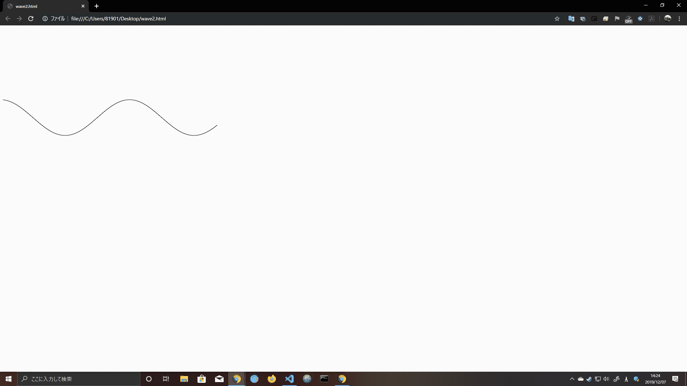

# HOBBIES REPO

## WELCOME TO MY HOBBIES REPO
**UNUSEFUL** codes are stored in this repository.

### WAVES  
----------------------------- 
* [sine wave](./waves/sinewave.html "sine wave")  
* [wave(Only html & CSS)](./waves/waveproto.html "wave proto")  
* [wave](./waves/wave.html "wave")  
wave are inspired by [Adobe XD - Water animation in 6 minutes.](https://youtu.be/Ev3fSi7P66c)  
#### sample images  

    

### PRIME NUMBER
-----------------------------
* [Trial Division](./primeNumber/trial-division.js "Trial Division")  
 This code check the whether an argument is prime or not.
* [Sieve Of Eratosthenes](./primeNumber/sieve-of-eratosthenes.js "Sieve Of Eratosthenes")  
 This code find the prime number between 2 and argument.
* [Sieve Of Sundaram](./primeNumber/sieve-of-sundaram.js "Sieve Of Sundaram")  
 This code find the prime number between 2 and (2argument+1).

### MATH
-----------------------------
* [GCD](./math/gcd.js "GCD")  
 This function is based on Euclidean Alogorithm.
* [Convert Dec to Bin](./math/convert-dec-to-bin.js "Convert Dec to Bin")  
 This function return 8 digit binary number from decimal.
